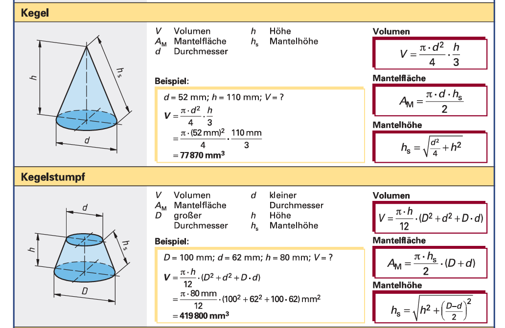
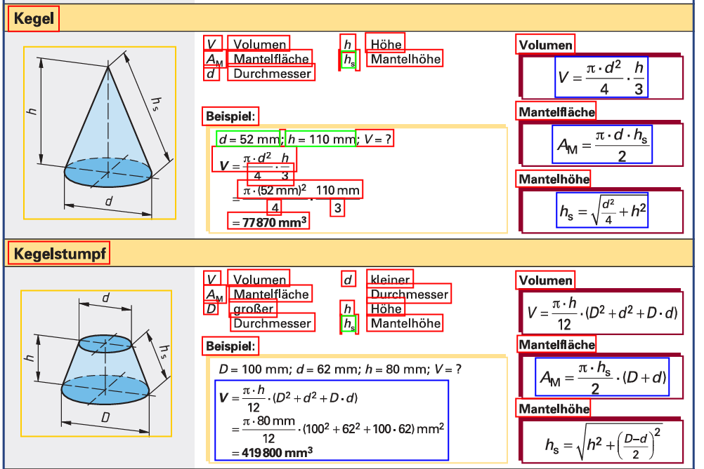

Structure & backbone:
---

<dataflow graph>

* LightRAG: used inside RAGAnything as the backend engine for vector search, query handling, and calling LLM/VLM APIs efficiently.

* The code uses two models total:
    1. LLM model → "gpt-4o-mini" (for text reasoning).
    2. VLM model → "gpt-4o" (for multimodal input like images, tables, equations).

Test the End-to-end processing framework:
---
Run and pass parameters like `file_path`, `api_key`, `base_url` and `parser` at runtime as following:
```bash
uv run python3 examples/raganything_example.py docs/gear.pdf --api-key your-openrouter-api-key --base-url https://openrouter.ai/api/v1 --parser mineru
```

Pipeline steps:
---

1. Create a **RAGAnythingConfig**: 
    - Purpose: Define how to preprocess and structure the input PDF into retrievable chunks.

    ```python
    config = RAGAnythingConfig(
        working_dir=working_dir or "./rag_storage",
        parser=parser,        # Parser selection: mineru or docling
        parse_method="auto",  # Parse method: auto, ocr, or txt
        enable_image_processing=True,
        enable_table_processing=True,
        enable_equation_processing=True,
    )
    ```
    - document parser: mineru or docling to extract text/tables/equations.
    - parse method: auto, ocr, or txt
    - enable Image, table, and equation extraction.

2. Create the embedding function **EmbeddingFunc()**:
    - Purpose: Convert document text into vector representations for retrieval. 

    ```python
    embedding_dim = int(os.getenv("EMBEDDING_DIM", "3072"))
    embedding_model = os.getenv("EMBEDDING_MODEL", "text-embedding-3-large")

    embedding_func = EmbeddingFunc(
        embedding_dim=embedding_dim,
        max_token_size=8192,
        func=lambda texts: openai_embed(
            texts,
            model=embedding_model,
            api_key=api_key,
            base_url=base_url,
        ),
    )
    ```
    - It uses **text-embedding-3-large** [https://platform.openai.com/docs/models/text-embedding-3-large] model from openAI to execute the embedding
    - It uses an embedding dimension of 3072

3. Define LLM and Vision model functions:

    - Purpose: Define how the retrieval system calls the LLM/VLM for reasoning and answer generation.

    * **llm_model_func**: wraps openai_complete_if_cache() to send text prompts to `gpt-4o-mini`.

    * **vision_model_func**: supports three modes:
        - Text-only queries
        - Image-based (base64-encoded JPEGs)
        - Fully multimodal messages (for tables, equations, etc.)


4. Create RAGAnything class
    - Purpose: 
        * Combine the config, embedding function, and both LLM functions into one RAG pipeline object.
        * Manage storage, indexing, retrieval, and query-answering.
        ```python
        rag = RAGAnything(
            config=config,
            llm_model_func=llm_model_func,
            vision_model_func=vision_model_func,
            embedding_func=embedding_func,
        )
        ```

5. Build the RAG knowledge base for the input document
    - Purpose: Parse the document (via MinerU), chunk it, embed chunks, and store them in a retrievable index.

        ```python
        await rag.process_document_complete(file_path, output_dir, parse_method="auto")
        ```

Parser:
---

1. MinerU (which parsing toolkit/model you use to convert the file into structured content):
    * Supports PDF, images, Office documents, and more formats
    * Powerful OCR and table extraction capabilities
    * GPU acceleration support

2. Docling: 
    * Optimized for Office documents and HTML files
    * Better document structure preservation
    * Native support for multiple Office formats

Parse method (how the chosen parser operates on a given file):
---
* **auto**: parser decides the best strategy (e.g., programmatic PDF vs scanned)
* **ocr**: force optical character recognition for scanned/low-text PDFs
* **txt**: treat the input as plain text (skip complex layout/tables)

RAG query modes:
---
* **local**: emphasizes context-dependent info (e.g., neighborhood graph around a node/section). 
* **global**: favors document-level knowledge and summarization across the whole corpus. 
* **hybrid**: mixes local + global retrieval (often best default). 
* **naive**: simple/keyword or basic vector search without advanced graph reasoning. 
* **mix**: integrates multiple retrieval signals (e.g., knowledge-graph + vector). 
* **bypass**: skips RAG retrieval and hits the LLM directly (no retrieval step).

Some results:
---

* **Input**: 
* **Parsed_Input**: 
* **Query/Prompt**: Give me the equation of the mantelfläche of a Kegelstumpf?
* **Answer**: The equation for calculating the **Mantelfläche** (lateral surface area) of a **Kegelstumpf** (truncated cone) is:

    $$
    A_{M} = \frac{\pi \cdot h_{s}}{2} \cdot (D + d)
    $$

    In this equation:
    - \(h_{s}\) is the slant height of the truncated cone.
    - \(D\) is the diameter of the larger base.
    - \(d\) is the diameter of the smaller base.

    This formula is essential for determining the lateral surface area that wraps around the curved side of the Kegelstumpf, commonly used in manufacturing and architectural design to calculate material needs and surface treatments.


Outro
---
For more information, please refer to the official [github repository] (https://github.com/HKUDS/RAG-Anything) of the RAGAnything framework