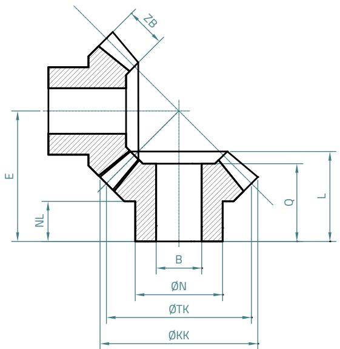
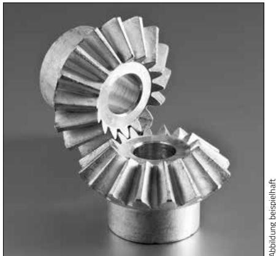

# Kegelräder aus Zink (ZnAl4Cu1)

# Übersetzung 1:1

Ausführung: geradverzahnt, gegossen, Eingriffswinkel $2 0 ^ { \circ }$ , Bohrungen mit Toleranz H 9 spanabhebend bearbeitet.   
Maßänderung vorbehalten.

<table><tr><td rowspan=1 colspan=1>M</td><td rowspan=1 colspan=1>z</td><td rowspan=1 colspan=1>B[mm]|</td><td rowspan=1 colspan=1>ON[mm]</td><td rowspan=1 colspan=1>OTK[mm]</td><td rowspan=1 colspan=1>OKK[mm]</td><td rowspan=1 colspan=1>E[mm]</td><td rowspan=1 colspan=1>NL[mm]</td><td rowspan=1 colspan=1>ZB</td><td rowspan=1 colspan=1>Q</td><td rowspan=1 colspan=1>L|[mm]|</td><td rowspan=1 colspan=1>G[g]</td><td rowspan=1 colspan=1>DM**[Ncm]</td><td rowspan=1 colspan=1>Art.-Nr.</td></tr><tr><td rowspan=1 colspan=1>1,0</td><td rowspan=1 colspan=1>16</td><td rowspan=1 colspan=1>6</td><td rowspan=1 colspan=1>12</td><td rowspan=1 colspan=1>16</td><td rowspan=1 colspan=1>17,7</td><td rowspan=1 colspan=1>17,9</td><td rowspan=1 colspan=1>7.5</td><td rowspan=1 colspan=1>4.5</td><td rowspan=1 colspan=1>13</td><td rowspan=1 colspan=1>13</td><td rowspan=1 colspan=1>7</td><td rowspan=1 colspan=1>21,82</td><td rowspan=1 colspan=1>KD1016-1:1ZN</td></tr><tr><td rowspan=1 colspan=1>1,5</td><td rowspan=1 colspan=1>16</td><td rowspan=1 colspan=1>8</td><td rowspan=1 colspan=1>19</td><td rowspan=1 colspan=1>24</td><td rowspan=1 colspan=1>26</td><td rowspan=1 colspan=1>25,2</td><td rowspan=1 colspan=1>10,7</td><td rowspan=1 colspan=1>6,9</td><td rowspan=1 colspan=1>17</td><td rowspan=1 colspan=1>18,6</td><td rowspan=1 colspan=1>27</td><td rowspan=1 colspan=1>73,13</td><td rowspan=1 colspan=1>KD1516-1:1ZN</td></tr><tr><td rowspan=1 colspan=1>2,0</td><td rowspan=1 colspan=1>16</td><td rowspan=1 colspan=1>10</td><td rowspan=1 colspan=1>23</td><td rowspan=1 colspan=1>32</td><td rowspan=1 colspan=1>34,8</td><td rowspan=1 colspan=1>30</td><td rowspan=1 colspan=1>10</td><td rowspan=1 colspan=1>9,6</td><td rowspan=1 colspan=1>19,2</td><td rowspan=1 colspan=1>21,3</td><td rowspan=1 colspan=1>52</td><td rowspan=1 colspan=1>185,77</td><td rowspan=1 colspan=1>KD2016-1:1ZN</td></tr><tr><td rowspan=1 colspan=1>2.5</td><td rowspan=1 colspan=1>16</td><td rowspan=1 colspan=1>12</td><td rowspan=1 colspan=1>26</td><td rowspan=1 colspan=1>40</td><td rowspan=1 colspan=1>43.3</td><td rowspan=1 colspan=1>36,2</td><td rowspan=1 colspan=1>12</td><td rowspan=1 colspan=1>12,3</td><td rowspan=1 colspan=1>23</td><td rowspan=1 colspan=1>25,5</td><td rowspan=1 colspan=1>88</td><td rowspan=1 colspan=1>357,06</td><td rowspan=1 colspan=1>KD2516-1:1ZN</td></tr><tr><td rowspan=1 colspan=1>3,0</td><td rowspan=1 colspan=1>16</td><td rowspan=1 colspan=1>14</td><td rowspan=1 colspan=1>30</td><td rowspan=1 colspan=1>48</td><td rowspan=1 colspan=1>52,3</td><td rowspan=1 colspan=1>42,5</td><td rowspan=1 colspan=1>13</td><td rowspan=1 colspan=1>14</td><td rowspan=1 colspan=1>26</td><td rowspan=1 colspan=1>29,3</td><td rowspan=1 colspan=1>146</td><td rowspan=1 colspan=1>576,86</td><td rowspan=1 colspan=1>KD3016-1:1ZN</td></tr><tr><td rowspan=1 colspan=1>3.5</td><td rowspan=1 colspan=1>16</td><td rowspan=1 colspan=1>16</td><td rowspan=1 colspan=1>34</td><td rowspan=1 colspan=1>56</td><td rowspan=1 colspan=1>61,4</td><td rowspan=1 colspan=1>49,2</td><td rowspan=1 colspan=1>14</td><td rowspan=1 colspan=1>15,5</td><td rowspan=1 colspan=1>29,2</td><td rowspan=1 colspan=1>33,2</td><td rowspan=1 colspan=1>228</td><td rowspan=1 colspan=1>898,94</td><td rowspan=1 colspan=1>KD3516-1:1ZN</td></tr></table>

\*\*) Bitte Angaben zu Drehmoment auf S. 14 beachten.