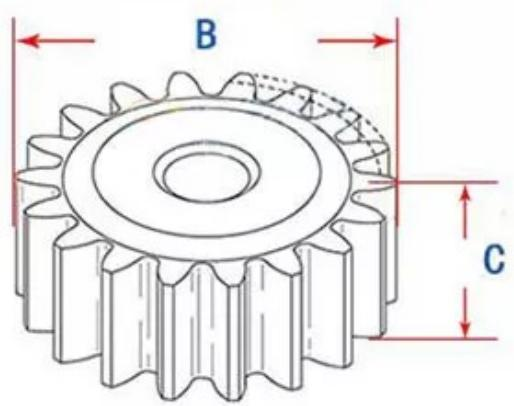
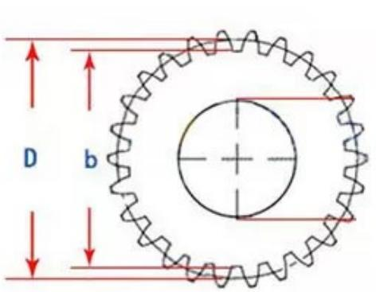

  
D: the diameter of the original node

  
B: outer diameter C:Thickness   
b: original diameter of tooth root

<table><tr><td rowspan=1 colspan=1>Number OfTeeth</td><td rowspan=1 colspan=1>B</td><td rowspan=1 colspan=1>C</td><td rowspan=1 colspan=1>D</td><td rowspan=1 colspan=1>b</td></tr><tr><td rowspan=1 colspan=1>1 M45 Teeth</td><td rowspan=1 colspan=1>47</td><td rowspan=1 colspan=1>10</td><td rowspan=1 colspan=1>45</td><td rowspan=1 colspan=1>42.5</td></tr><tr><td rowspan=1 colspan=1>1M46 Teeth</td><td rowspan=1 colspan=1>48</td><td rowspan=1 colspan=1>10</td><td rowspan=1 colspan=1>46</td><td rowspan=1 colspan=1>43.5</td></tr><tr><td rowspan=1 colspan=1>1 M47 Teeth</td><td rowspan=1 colspan=1>49</td><td rowspan=1 colspan=1>10</td><td rowspan=1 colspan=1>47</td><td rowspan=1 colspan=1>44.5</td></tr><tr><td rowspan=1 colspan=1>1 M 48 Teeth</td><td rowspan=1 colspan=1>50</td><td rowspan=1 colspan=1>10</td><td rowspan=1 colspan=1>48</td><td rowspan=1 colspan=1>45.5</td></tr><tr><td rowspan=1 colspan=1>1 M 49 Teeth</td><td rowspan=1 colspan=1>51</td><td rowspan=1 colspan=1>10</td><td rowspan=1 colspan=1>49</td><td rowspan=1 colspan=1>46.5</td></tr><tr><td rowspan=1 colspan=1>1 M 50Teeth</td><td rowspan=1 colspan=1>52</td><td rowspan=1 colspan=1>10</td><td rowspan=1 colspan=1>50</td><td rowspan=1 colspan=1>47.5</td></tr><tr><td rowspan=1 colspan=1>1 M51 Teeth</td><td rowspan=1 colspan=1>53</td><td rowspan=1 colspan=1>10</td><td rowspan=1 colspan=1>51</td><td rowspan=1 colspan=1>48.5</td></tr><tr><td rowspan=1 colspan=1>1 M52 Teeth</td><td rowspan=1 colspan=1>54</td><td rowspan=1 colspan=1>10</td><td rowspan=1 colspan=1>52</td><td rowspan=1 colspan=1>49.5</td></tr><tr><td rowspan=1 colspan=1>1 M 53 Teeth</td><td rowspan=1 colspan=1>55</td><td rowspan=1 colspan=1>10</td><td rowspan=1 colspan=1>53</td><td rowspan=1 colspan=1>50.5</td></tr><tr><td rowspan=1 colspan=1>1M54Teeth</td><td rowspan=1 colspan=1>56</td><td rowspan=1 colspan=1>10</td><td rowspan=1 colspan=1>54</td><td rowspan=1 colspan=1>51.5</td></tr><tr><td rowspan=1 colspan=1>1M55Teeth</td><td rowspan=1 colspan=1>57</td><td rowspan=1 colspan=1>10</td><td rowspan=1 colspan=1>55</td><td rowspan=1 colspan=1>52.5</td></tr><tr><td rowspan=1 colspan=1>1M56Teeth</td><td rowspan=1 colspan=1>58</td><td rowspan=1 colspan=1>10</td><td rowspan=1 colspan=1>56</td><td rowspan=1 colspan=1>53.5</td></tr><tr><td rowspan=1 colspan=1>1M 57 Teeth</td><td rowspan=1 colspan=1>59</td><td rowspan=1 colspan=1>10</td><td rowspan=1 colspan=1>57</td><td rowspan=1 colspan=1>54.5</td></tr><tr><td rowspan=1 colspan=1>1M 58 Teeth</td><td rowspan=1 colspan=1>60</td><td rowspan=1 colspan=1>10</td><td rowspan=1 colspan=1>58</td><td rowspan=1 colspan=1>55.5</td></tr><tr><td rowspan=1 colspan=1>1M59Teeth</td><td rowspan=1 colspan=1>61</td><td rowspan=1 colspan=1>10</td><td rowspan=1 colspan=1>59</td><td rowspan=1 colspan=1>56.5</td></tr><tr><td rowspan=1 colspan=1>1M60 Teeth</td><td rowspan=1 colspan=1>62</td><td rowspan=1 colspan=1>10</td><td rowspan=1 colspan=1>60</td><td rowspan=1 colspan=1>57.5</td></tr></table>