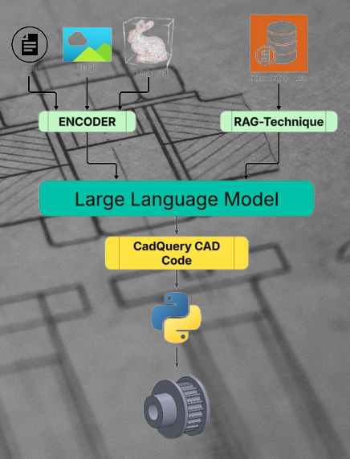

  

 

  

 

  

    
    
     
    
    
  

 
 

# Project idea:

The project aims to create 3D models of spur gears using LLM text prompting and RAG for efficient searching of mechanical component catalogs.

# Currently working on:
- **RAG-4-catalogs**: check out this [branch](https://github.com/Raouf71/genAI_3D_CAD/tree/dev_rag) for new updates.

# Coming soon:
- WIKI page hosting the project documentation
- RAG-Chatbot with UI

  

